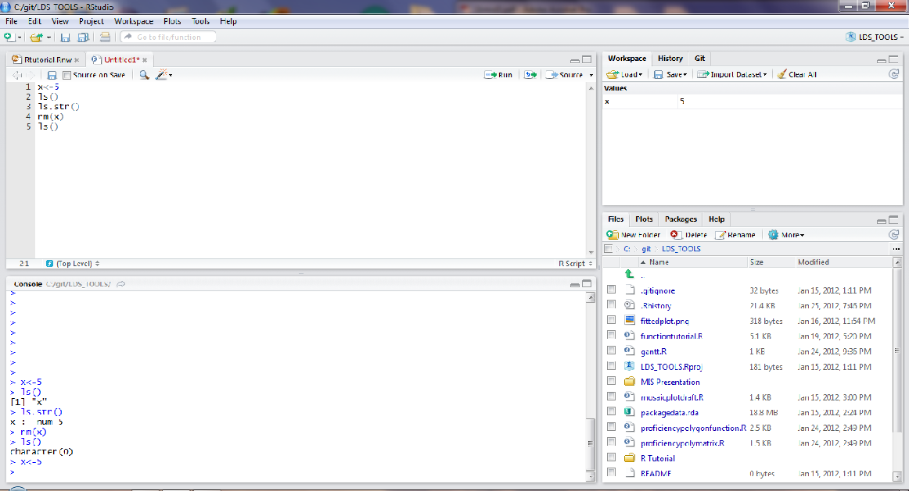
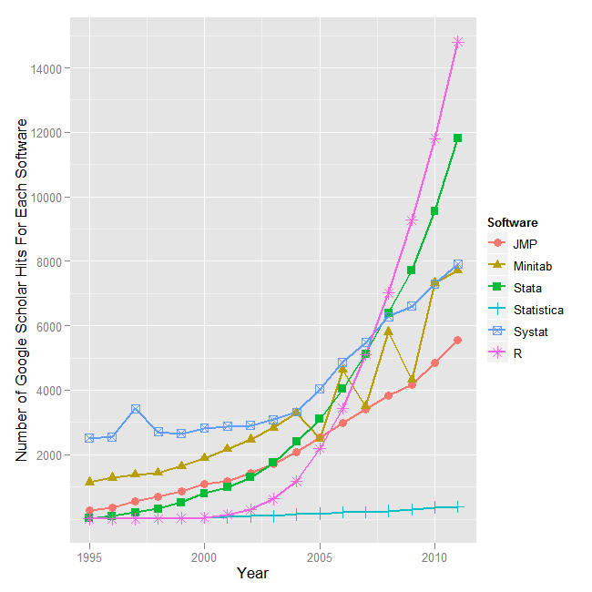
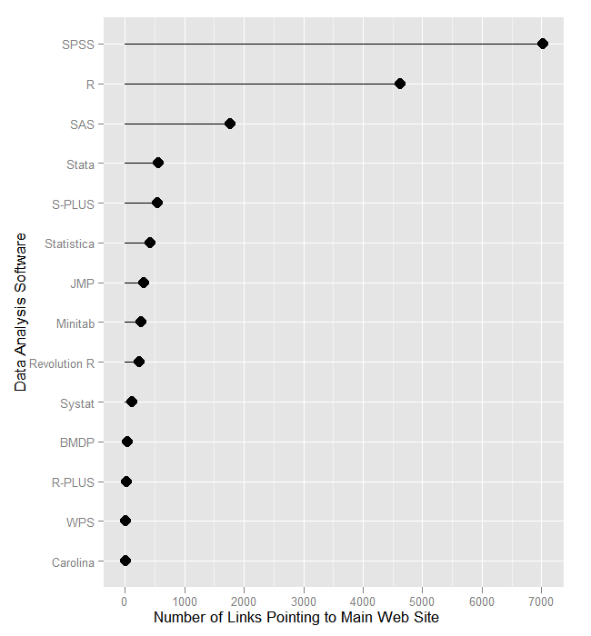
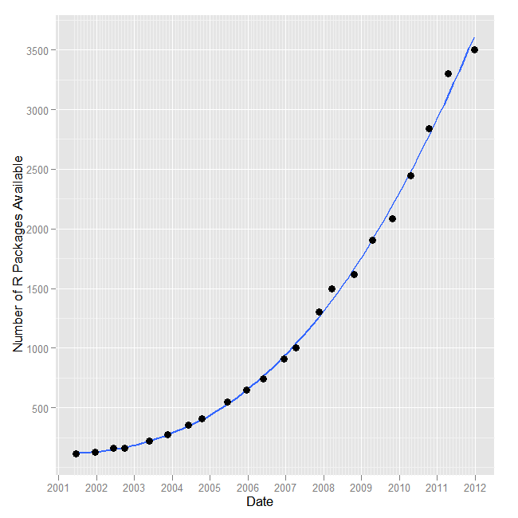
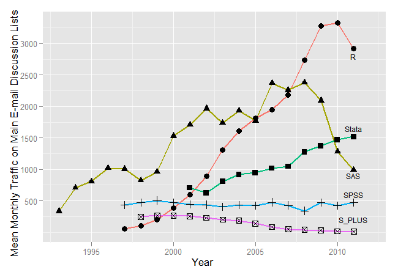

% Tutorial 1: Getting Started
% DPI R Bootcamp
% Jared Knowles

```{r setup, include=FALSE}
# set global chunk options
opts_chunk$set(fig.path='figure/slides-', cache.path='cache/slides-', cache=TRUE)
# upload images automatically
#opts_knit$set(upload.fun = imgur_upload)
```

# Overview
- What is R?
- What is RStudio?
- How does it work?
- What makes the language different?
- Why learn it?
<p align="center"></p>

# R
- R is an Open Source (and freely available) environment for statistical computing and graphics
- Available for Windows, Mac OS X, and Linux
- R is being actively developed with two major releases per year and dozens of releases of add on packages
- R can be extended with 'packages' that contain data, code, and documentation to add new functionality

# What Does it Look Like?
The R workspace in RStudio

<p align="center"></p>

# A Bit of Histo**R**y
- R is a flavor of the **S** computer language
- S was developed by John Chambers at Bell Labs in the late 1970s
- In 1988 it was rewritten from a Fortran base to a C base
- Version 4 of S, the latest version, was finished in 1998, and won several awards

# The Philosophy
John Chambers, in describing the logic behind the S language said:

> [W]e wanted users to be able to begin in an interactive
> environment, where they did not consciously think of
> themselves as programming. Then as their needs became
> clearer and their sophistication increased, they should be
> able to slide gradually into programming, when the
> language and system aspects would become more
> important.


# R is Born
- 1991 in New Zealand Ross Ihaka and Robert Gentleman create R
- Named for their first initials
- R is made public in 1993, and in 1995 Martin Maechler convinces the creators to make it open source with the GNU General Public License
- 1997 R Core Group is formed--the maintainers and main developers of R (about 14 members today)
- 2000 version 1.0.0 ships
- 2012 version 2.15.1 is available


# Why Use R
- R is a common tool among data experts at major universities
- No need to go through procurement, R can be installed in any environment on any machine and used with no licensing or agreements needed
- R source code is very readable to increase transparency of processes
- R code is easily borrowed from and shared with others
- R is incredibly flexible and can be adapted to specific local needs
- R is under incredibly active development, improving greatly, and supported wildly by both professional and academic developers

# Thoughts on Free
- R is free in many senses
  1. R can be run and used for any purpose, commercial or non-commercial, profit or not-for-profit
  2. R's source code is freely available so you can study how it works and adapt it to your needs.
  3. R is free to redistribute so you can share it with your ~~enemies~~  friends
  4. R is free to modify and those modifications are free to redistribute and may be adopted by the rest of the community!


# R Advantages Continued
- R is platform agnostic--Linux, Mac, PC, server, desktop, etc.
- R can output results in a variety of formats
- R can build routines straight out of a database for common and universal reporting

R Can Compliment Other Tools
------------------------------------
- R plays nicely with data from Stata, SPSS, SAS and others
- R can check work, produce output, visualize results from other programs
- R can do bleeding edge analysis that aren't available in proprietary packages yet
- R is becoming more prevalent in undergraduate statistics courses

# R's Drawbacks
- R is based on S, which is close to 40 years old
- R only has features that the community contributes
- Not the ideal solution to all problems
- R is a programming language and not a software package--steeper learning curve

# Google Scholar Hits
R has recently passed Stata on Google Scholar hits and it is catching up to the two major players SPSS and SAS

<p align="center"></p>

# R Has an Active Web Presence
R is linked to from more and more sites 

<p align="center"></p>

# R Extensions
These links come from the explosion of add-on packages to R

<p align="center"></p>

# R Has an Active Community 
Usage of the R listserv for help has really exploded recently

<p align="center"></p>

# R Vocabulary
- **packages** are add on features to R that include data, new functions and methods, and extended capabilities. Think of them as ``apps'' on your phone.
- **terminal** this is the main window of R where you enter commands
- **scripts** these are where you store commands to be run in the terminal later, like syntax in SPSS or .do files in Stata
- **functions** commands that do something to an object in R
- **dataframe** the main element for statistical purposes, an object with rows and columns that includes numbers, factors, and other data types
- **workspace** the working memory of R where all objects in the current session are stored
- **vector** the basic unit of data in R
- **symbols** anything not starting with a digit, can be used to name and store objects or to designate operations/functions
- **attributes** determine how functions act on objects

# Components of an R Setup
- **R** - obviously we need R. R works in the command line of any OS, but also comes with a basic GUI to operate on its own in Windows and Mac [download](http://cran.r-project.org/)
- **RStudio** - a much better way to work in R that allows editing of scripts, operation of R, viewing of the workspace, and R help all on one screen [download](http://rstudio.org/download/)
- **LaTeX** - for producing documents using R this is less necessary, but still useful. download [WIN](http://miktex.org/2.9/setup) [MAC](http://www.tug.org/mactex/2011/)

**ADVANCED**

- **Dev Tools for R** - on Windows this is Rtools, on Linux and Mac it is installing the development mode of R download [WIN](http://www.stats.ox.ac.uk/pub/Rtools/R215x.html) [MAC](http://cran.r-project.org/bin/macosx/tools/)
- **Git** - for version control, sharing code, and collaboration this is essential. It integrates well with RStudio. [download](http://git-scm.com/download)
- **pandoc** - for converting output into other formats for sharing with non-user**R**s! [download](http://johnmacfarlane.net/pandoc/installing.html)
- **ImageMagick** - for creating more flexible graphics in R, including animations! [download](http://www.imagemagick.org/script/index.php) [alternate](http://www.graphicsmagick.org/)

# Open Source Toolchain
- This really represents a completely open source toolchain to going from a data analysis idea, to a full fledged professional report
- These tools are free, updated regularly, and available on **any** platform **today**

# Some Notes about Maintaining R
- Adding packages onto R means you also have to update them with the `update.packages()` command
- Upgrading R, which is on a 6 month release cycle, is not straightforward
- We will walk through this a bit later, but remember that the flexibility in R means that users probably need to be self-supported

# Self-help
- In the spirit of open-source R is very much a self-guided tool
- Let's see, type: `?summary`
- Now type: `??regression`
- For tricky questions, funky error messages (there are many), and other issues, use Google (include "in R" to the end of your query)


# R As A Calculator

```{r computing,echo=TRUE,results='markup'}
2+2 # add numbers
2*pi #multiply by a constant
7+runif(1,min=0,max=1) #add a random variable
4^4 # powers
sqrt(4^4) # functions
```

# Arithmetic Operators
- In addition to the obvious `+` `-` `=` `/` `*` and exponential `^`, there is also integer division `%/%` and remainder in integer division (known as modulo arithmetic) `%%`
```{r arithmetic}
2+2
2/2
2*2
2^2
2==2
23 %/% 2 
23 %% 2
```

# Other Key Symbols
- `<-` is the assignment operator, it declares something is something else
```{r}
foo<-3
foo
```
- `:` is the sequence operator
```{r}
1:10
# it increments by one
a<-100:120
a
```
- **This is handy**

# Comments in R
- **#** denotes a comment in R
- Anything after the **#** is not evaluated and ignored in R
- This is handy for making things reproducible

```{r poundsigns,eval=FALSE,echo=TRUE}
# Something I want to keep from R
# Like my secret from the R engine
# Maybe intended for a human and not the computer
# Like: Look at this cool plot!

myplot(readSS,mathSS,data=df)
```

# R Advanced Math
- R also supports advanced mathematical features and expressions
- R can take integrals and derivatives and express complex functions
- Easiest of all, R can generate distributions of data very easily
- This comes in handy when writing examples and building analyses


# Using the Workspace
- To do more we need to learn how to manipulate the 'workspace'.
- This includes all the vectors, datasets, and functions stored in memory.
- All R objects are stored in the memory of the computer, limiting the available space for calculation to the size of the RAM on your machine.
- R makes organizing the workspace easy.

# Using the Workspace (2)
```{r}
x<-5 #store a variable with <-
x    #print the variable
z<-3 
ls() #list all variables
ls.str() #list and describe variables
rm(x)    # delete a variable
ls()
```

# R as a Language
- R is more than statistical software, it is a computer language
- Like any language it has rules (some poorly enforced), and conventions
- You will learn more as you go, but we'll go over a few to start

1. Case sensitivity matters
```{r}
a<-3
A<-4
print(c(a,A))
```
  * <font color="red">**a** &#8800; **A**</font> 
2. What happens if I type **print(a,A)**?

# `c` is our friend
- So what does **c** do?
```{r}
A<-c(3,4)
print(A)
```
- `c` stands for concatenate and allows vectors to have multiple elements

# Language
- In language there are a number of ways to say the same thing
  *  <font color="green">The dog chased the cat.</font> 
  *  <font color ="blue">The cat was chased by the dog.</font>
  *  <font color ="red">By the dog, the cat was chased.</font>
- Some ways are more elegant than others, all convey the same message. 
```{r language}
a<-runif(100) # Generate 100 random numbers
b<-runif(100) # 100 more
c<-NULL       # Setup for loop (declare variables)
for(i in 1:100){  # Loop just like in Java or C
c[i]<-a[i]*b[i]
}
d<-a*b
identical(c,d) # Test equality
```
- Which is nicer?

# More Language ~~Bugs~~ Features
- R is maddeningly inconsistent
  * Some functions are `camelCase`; others `are.dot.separated`; others `use_underscores`
  * Function results are stored in a variety of ways across function implementations
  * R has multiple graphics packages that different functions use for default plot construction (`base`, `grid`, `lattice`, and `ggplot2`)

# Reading Data In
- To read data in we have to tell R where it currently is on the filesystem by setting a working directory
- Then we have to tell it where to look for the dataset and what format that dataset is in
- CSV files are **simplest** for beginning use cases, but R is flexible `{r load('data/smalldata.rda')}`
```{r eval=FALSE}
# Set working directory to the tutorial director
# In RStudio can do this in "Tools" tab
setwd('~/r_tutorial_ed')
#Load some data
df<-read.csv('data/smalldata.csv')
# Note if we don't assign data to 'df'
# R just prints contents of table
```

# Objects
- Everything in R is an object--even functions
- Objects can be manipulated many ways
- A common example is applying the `summary' function to a variety of object types and seeing how it adapts
```{r}
summary(df[,28:31]) #summary look at df object
summary(df$readSS) #summary of a single column
```
-The `$` says to look for object **readSS** in object **df**

# Graphics too

```{r graphics1, results='fig',message=FALSE,dev='svg',fig.cap='Student Test Scores', fig.width=7.8, fig.height=4.5}
library(ggplot2) # Load graphics Package
qplot(readSS,mathSS,data=df,geom='point',alpha=I(0.3))+theme_bw()+
  opts(title='Test Score Relationship')+
  geom_smooth()
```

# Handling Data in R
- R handles data differently than many other statistical packages
- In R, all elements are objects
```{r}
length(unique(df$school))
length(unique(df$stuid))
uniqstu<-length(unique(df$stuid))
uniqstu
```
- Results of function calls can be stored


# Special Operators
- The comparison operators `<`, `>`, `<=`, `>=`, `==`, and `!=` are used to compare values across vectors
```{r vectorcomp}
big<-c(9,12,15,25)
small<-c(9,3,4,2)
# Give us a nice vector of logical values
big>small
big=small
# Oops--don't do this, reassigns big to small
print(big)
print(small)
```
- Comparison operators can be tricky, so to keep it straight never use `=` or `==` to assign anything, always use `<-`

# Special Operators II
- The best way to evaluate these objects is to use brackets `[]` to avoid confusion

```{r brackets}
big<-c(9,12,15,25)
big[big==small]
# Returns values where the logical vector is true
big[big>small]
big[big<small] # Returns an empty set
```

# Special operators (III)
- The `%in%` operator determines whether each value in the left operand can be matched with one of the values in the right operand.
```{r specialoperand}
big<-c(9,12,15,25)
small<-c(9,12,15,25,9,1,3)
big[small %in% big]
```
- 9, 12, 15, and 25 all appear in `big`, but `small` also has objects that do not appear in `big` and so an NA is returned
- What if we reverse this?
```{r operand2}
big[big %in% small]
```
- No `NA`

# Special operators (IV)
- The logical operators `||` (or) and `&&` (and) can be used to combine two logical values and produce another logical value as the result. The operator `!` (not) negates a logical value. These operators allow complex conditions to be constructed.
```{r vectorlogic}
foo<-c('a',NA,4,9,8.7)
!is.na(foo) # Returns TRUE for non-NA
class(foo)
a<-foo[!is.na(foo)]
a
class(a)
```

# Simple Data Cleaning Function
- What if we want to extract the numeric elements out of `foo` which has both a character and a missing value?

```{r declassfunction}
extractN<-function(x){
  x<-suppressWarnings(as.numeric(x))
  #ignore warnings because we don't care
  x<-x[!is.na(x)]
  x
}
extractN(foo)
A<-extractN(foo)
```


# Special operators (V)
- The operators `|` and `&` are similar, but they combine two logical vectors. The comparison is performed element by element, so the result is also a logical vector.

# Regular Expressions
- R also supports a full suite of regular expressions
- This could be material for a full tutorial and another time\
- We can talk about this in the advanced topics section


# Data Modes in R (numeric)
- R allows users to implement a number of different types of data
- The three basic data types are numeric data, character data, and logical data
- **numeric** includes valid numbers

```{r}
is.numeric(A)
class(A)
print(A)
```

# Data Modes (Character)
- **character** is known as strings in other software, any characters that have no numeric meaning

```{r}
b<-c('one','two','three')
print(b)
is.numeric(b)
```

# Data Modes (Logical)
- **logical** is TRUE or FALSE values, useful for logical testing and programming

```{r}
c<-c(TRUE,TRUE,TRUE,FALSE,FALSE,TRUE)
is.numeric(c)
is.character(c)
is.logical(c) # Results in a logical value
```

# Easier way
- Just ask R using the `class` function

```{r class}
class(A)
class(b)
class(c)
```

# A Note on Vectors
- Vectors are collections of consistent data types
- **numeric** can either be double or integer depending on the *bytes* size
- **logical**
- **character**
- **complex**
- **raw**
- All vectors must be consistent among types, but some data objects can consist of vectors with different types

# Factor
- A factor is a very special and sometimes frustrating data type in R

```{r fac}
myfac<-factor(c("basic","proficient","advanced","minimal"))
class(myfac)
myfac # What order are the factors in?
```
- What if we don't like the order these are in? Factor order is important for all kinds of things like plot type, regression output, and more

# Ordering the Factor
- Ordered factors simply have an additional attribute explaining the order of the levels of a factor
- This is a useful shortcut when we want to preserve some of the meaning provided by the order
- Think cardinal data

```{r orderedfac}
myfac_o<-ordered(myfac,levels=c("minimal","basic","proficient","advanced"))
myfac_o
summary(myfac_o)
```

# Reclassifying Factors
- Turning factors into other data types can be tricky. All factor levels have an underlying numeric structure.

```{r fac2}
class(myfac_o)
unclass(myfac_o)
defac<-unclass(myfac_o)
defac
```

- What is wrong with this? Well--why would `minimal` be `2` and `basic` be `3`?
- Be careful! The best way to unpack a factor is to convert it to a character first.

# Defactor
```{r fac3}
defac<-function(x){
  x<-as.character(x)
  x
}
defac(myfac_o)
defac<-defac(myfac_o)
defac
```

# Convert to Numeric?
- What if we do want it to be numeric?
- The best way to do this is to recode the variable manually--we'll discuss this later
- You can try to convert it to numeric though, but do at your own risk:

```{r numericfac}
myfac_o
as.numeric(myfac_o)
```
- If we did not properly specify the order above, this would be wrong!

```{r numericfacwrong}
myfac
as.numeric(myfac)
```

# Dates
- R has built-in ways to handle dates
- See `lubridate` package for more advanced functionality

```{r dates}
mydate<-as.Date("7/20/2012",format="%m/%d/%Y")
# Input is a character string and a parser
class(mydate) # this is date
weekdays(mydate) # what day of the week is it?
mydate+30 # Operate on dates
```

# More Dates

```{r moredates1}
# We can parse other formats of dates
mydate2<-as.Date("8-5-1988",format="%d-%m-%Y") 
mydate2

mydate-mydate2
# Can add and subtract two date objects
```

# A few notes on dates
- R converts all dates to numeric values, like Excel and other languages
- The origin date in R is January 1, 1970

```{r moredates}
as.numeric(mydate) # days since 1-1-1970
as.Date(56,origin="2013-4-29") # we can set our own origin
```

# Other Classes
- R classes can be specified for any special purpose
- Like linear models

```{r linmod}
b<-rnorm(5000)
c<-runif(5000)
a<-b+c
mymod<-lm(a~b)
class(mymod)
```

# Why care so much about classes?
- Classes determine what you can and can't do with objects
- Classes have different computational times associated with them, for optimization
- Classes allow you to keep projects/data organized and following business rules
- **Because R makes you care**

# Data Structures in R
- R has a number of basic data classes as well as arbitrary specialized object types for various purposes
- **vectors** are the basic data class in R and can be thought of as a single column of data (even a column of length 1)
- **matrices and arrays** are rows and columns of all the same mode data
- **dataframes** are rows and columns where the columns can represent different data types
- **lists** are arbitrary combinations of disparate object types in R

# Vectors 
- Everything is a vector in R, even single numbers
- Single objects are "atomic" vectors

```{r vectors}
print(1)
# The 1 in braces means this element is a vector of length 1
print("This tutorial is awesome")
# This is a vector of length 1 consisting of a single "string of characters"
```

# Vectors 2
```{r vectors2}
print(LETTERS) 
# This vector has 26 character elements
print(LETTERS[6])
# The sixth element of this vector has length 1
length(LETTERS[6])
# The length of that element is a number with length 1
```

# Matrices
- Matrices are combinations of vectors of the same length and data type
- We can have numeric matrices, character matrices, or logical matrices
- Can't mix types

```{r matrix}
mymat<-matrix(1:36,nrow=6,ncol=6)
rownames(mymat)<-LETTERS[1:6]
colnames(mymat)<-LETTERS[7:12]
class(mymat)
```

# Matrices II

```{r matrix2}
rownames(mymat)
colnames(mymat)
mymat
```


# More Matrices
- We can add to matrices

```{r matrix3}
dim(mymat) # We have 6 rows and 6 columns
myvec<-c(5,3,5,6,1,2)
length(myvec) # What happens when you do dim(myvec)?
newmat<-cbind(mymat,myvec)
newmat
```
- Dataframes work similar

# Matrix Functions
- We can do some basic math to matrices as well, like correlations

```{r matrix4}
foo.mat<-matrix(c(rnorm(100),runif(100),runif(100),rpois(100,2)),ncol=4)
head(foo.mat)
cor(foo.mat)
```

- The result is a matrix itself, but we can force it to be something else

# Converting Matrices
- Let's make a matrix be a dataframe
```{r matrixdance}
mycorr<-cor(foo.mat)
class(mycorr)
mycorr2<-as.data.frame(mycorr)
class(mycorr2)
mycorr2
```

# Arrays
- Arrays are a set of matrices of the same `dim` and `class`
- Arrays allow dimensions to be named

```{r array}
myarray<-array(1:42,dim=c(7,3,2),dimnames=list(c("tiny","small",
                    "medium","medium-ish","large","big","huge"),
                     c("slow","moderate","fast"),c("boring","fun")))
class(myarray)
dim(myarray)
```

# Arrays II

```{r array2}
dimnames(myarray)
myarray
```


# Lists
- Lists are arbitrary collections of objects. 
- The objects do not have to be of the same type or same element or same dimensions

```{r lists}
mylist<-list(vec=myvec,mat=mymat,arr=myarray,date=mydate)
class(mylist)
length(mylist)
names(mylist)
```

# Print a List
```{r listprint}
str(mylist)
```

# Lists (II)
- R has two object classification schemes S3 and S4
  - For S3 use `$` or `[[]]` to extract elements
  - For S4 use `@` to extract elements

```{r lists2}
mylist$vec
mylist[[2]][1,3]
```

- Where are we getting the object in the second row from?

# So what?
- Matrices, lists, and arrays are useful for storing analyses results, generating reports, and doing analysis on many objects types
- We'll see examples of list and array manipulation later
- A useful tip is to use the `attributes` function to learn about the object

```{r attr}
attributes(mylist)
attributes(myarray)[1:2][2]
```

- They also provide simplified ways to get used to operating on dataframes by reducing complexity


# Dataframes
- Dataframes are combinations of vectors of the same length, but can be of different types
```{r dataframetypes}
str(df[,25:32])
```
- Data frames must have consistent dimensions
- Dataframes are what we use most commonly as a "dataset" for analysis
- Dataframes are what sets R apart from other programming languages like C, C++, Python, and Perl. 
- The dataframe structure is much more complex and much easier to use than any datastructure in these languages--though Python is catching up!

# Summing it Up
- Vectors are used to store bits of data
- Matrices are combinations of vectors of the same length and type
- Matrices are most commonly used in statistical models (in the background), and for computation
- Arrays are stacks of matrices and are used in building multiple models or for storing complex data structures
- Lists are groups of R objects commonly used to combine function output in useful ways (like store model results and model data together)


# Exercises

1. Create a matrix of 5x6 dimensions. Add a vector to it (as either a row or column). Identify element 2,3. 

2. Read in the sample datafile. Find the `readSS` (reading scale score) for student 205 in grade 4. 

3. Create a list of two attributes for each district in the `df` datafile. 

# Other References
- [An R Vocabulary for Starting Out](https://github.com/hadley/devtools/wiki/vocabulary)
- [UCLA Academic Technology Services: R Starter Kit](http://www.ats.ucla.edu/stat/r/sk/)
- [Quick R: Getting Started](http://www.statmethods.net/)
- [R Features List](http://www.revolutionanalytics.com/what-is-open-source-r/r-language-features/)
- [Video Tutorials](http://www.twotorials.com/)
- [Google's R Style Guide](http://google-styleguide.googlecode.com/svn/trunk/google-r-style.html)
- [Hadley Wickham's R Style Guide](https://github.com/hadley/devtools/wiki/Style)
- [JSM 2012 R Introduction by Jay Emerson](http://www.stat.yale.edu/~jay/JSM2012/PDFs/intro.pdf)
- [Notes on R for Programmers by John Cook](http://www.johndcook.com/R_language_for_programmers.html)

# Books
- There are a number of great R books available for learning the beginnings of R and for learning specific statistical techniques
- "Discovering Statistics Using R" by Andy Field
- "Applied Econometrics with R" by Achim Zeileis and Christian Kleiber
- "The Art of R Programming" by Norman Matloff
- [The R Inferno](http://www.burns-stat.com/pages/Tutor/R_inferno.pdf)
- The R Book by Michael J. Crawley (new version imminent)
- The R Cookbook

# Session Info

It is good to include the session info, e.g. this document is produced with **knitr** version `r packageVersion('knitr')`. Here is my session info:

```{r session-info}
print(sessionInfo(), locale=FALSE)
```


# Attribution and License
<p xmlns:dct="http://purl.org/dc/terms/">
<a rel="license" href="http://creativecommons.org/publicdomain/mark/1.0/">

</a>
<br />
This work (<span property="dct:title">R Tutorial for Education</span>, by <a href="www.jaredknowles.com" rel="dct:creator"><span property="dct:title">Jared E. Knowles</span></a>), in service of the <a href="http://www.dpi.wi.gov" rel="dct:publisher"><span property="dct:title">Wisconsin Department of Public Instruction</span></a>, is free of known copyright restrictions.
</p>

