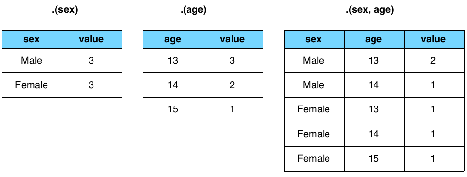

% Tutorial 3: Manipulating Data in R
% DPI R Bootcamp 
% Jared Knowles

# Overview
In this lesson we hope to learn:

- Aggregating data
- Organizing our data
- Manipulating vectors
- Dealing with missing data

<p align="center"></p>

```{r setup, include=FALSE}
# set global chunk options
opts_chunk$set(fig.path='figure/slides3-', cache.path='cache/slides3-',fig.width=8,fig.height=6,message=FALSE,error=FALSE,warning=FALSE,echo=TRUE,dev='svg',comment=NA,size='tiny')
options(width=70)
library(plyr)
```


# Again, read in our dataset
```{r readdata}
# Set working directory to the tutorial directory
# In RStudio can do this in "Tools" tab
setwd('~/GitHub/r_tutorial_ed')
#Load some data
load("data/smalldata.rda")
# Note if we don't assign data to 'df'
# R just prints contents of table
```

# Aggregation

- Sometimes we need to do some basic checking for the number of observations or types of observations in our dataset
- To do this quickly and easily - the `table` function is our friend
- Let's look at our observations by year and grade

```{r table}
table(df$grade,df$year)
```

- The first command gives the rows, the second gives the columns
- Ugly, but effective

# Aggregation can be more complex
- Let's aggregate by race and year

```{r table2}
table(df$year,df$race)
```

- Race is consistent across years, interesting
- What if we want to only look at 3rd graders that year?

# More complicated still

```{r table3}
with(df[df$grade==3,],{table(year,race)})
```

- `with` specifies a data object to work on, in this case all elements of `df` where `grade==3`
- `table` is the same command as above, but since we specified the data object in the `with` statement, we don't need the `df$` in front of the variables of interest
```{r table3.2}
df2<-subset(df,grade==3)
table(df2$year,df2$race)
rm(df2)
```

# Quick exercise
- Can you find the number of black students in each grade in each year?
- hint: **`with(df[df$___==___,]...)`**
- How many in year 2002, grade 6?
  - 48
- How many in 2001, grade 7?
  - 39


# Answer
```{r table4,tidy=FALSE}
with(df[df$race=="B",],{table(year,grade)})
```
- Quick question, how can we understand the three types of closures we have in this function: **()** **[]** and **{}**

# Tables cont.
- This is really powerful for looking at the descriptive dimensions of the data, we can ask questions like:
- How many students are at each proficiency level each year?

```{r proftable}
table(df$year,df$proflvl)
```

- How many students are at each proficiency level by race?

```{r raceproftable}
table(df$race,df$proflvl)
```

# Proportional Tables
- What if we aren't interested in counts? 
- R makes it really easy to calculate proportions

```{r proptable1}
prop.table(table(df$race,df$proflvl))
```

- Hmmm, this is goofy. This tells us the proportion of each cell out of the total. Also, the digits are distracting. How can we fix this?

# Try number 2

```{r proptable2}
round(prop.table(table(df$race,df$proflvl),1),digits=3)
```

- The `1` tells R we want proportions rowise, a `2` goes columnwise
- `round` tells R to cut off some digits for us
- Proportions are just that, not in percentage terms (we need to multiply by 100 for this)
- Can you make this table express percentages instead of proportions? How might that code look?
- A few more problems arise - this pools all observations, including students across years
- To avoid these, we need to aggregate the data somehow

# Checking Understanding
- We have seen how to chain functions together
- We have also seen how to examine a dataframe by looking at the observations in it
- We are now going to move on to aggregating data so we can look at unique cases when we have more than one observation for each unit

# Aggregating Data
- One of the most common questions you need to answer is to compute aggregates of data
- R has an `aggregate` function that can be used and helps us avoid the clustering problems above
- This works great for simple aggregation like scale score by race, we just need a `formula` (think I want variable X **by** grouping factor Y) and the statistic we want to compute

```{r aggregate1}
# Reading Scores by Race
aggregate(readSS~race,FUN=mean,data=df)
```


# Aggregate (II)
- `aggregate` can take us a little further, we can use aggregate multiple variables at a time

```{r aggregate2}
aggregate(cbind(readSS,mathSS)~race,data=df,mean)
```

- We can add multiple grouping varialbes using the `formula` syntax

```{r aggregate3}
head(aggregate(cbind(readSS,mathSS)~race+grade,data=df,mean),8)
```

# Crosstabs
- We can build a systematic cross-tab now

```{r crosstab}
ag<-aggregate(readSS~race+grade,data=df,mean)
xtabs(readSS~., data=ag)
```
- And prettier output

```{r crosstabpretty}
ftable(xtabs(readSS~.,data=ag))
```

# Check your work
- What is the mean reading score for 6th grade students with disabilities?

  * __481.83__
  
- How many points is this from non-disabled students?

  * __29.877__


# Answer II

```{r aggregatetest}
aggregate(cbind(readSS,mathSS)~disab+grade,data=df,mean)
```


# School Means
- Consider the case we want to turn our student level data into school level data
- Who hasn't had to do this?!?
- In `aggregate` we do:

```{r aggregate4}
z<-aggregate(readSS~dist,FUN=mean,data=df)
z
```

- But I want more! I want to aggregate multiple variables. I want to do it across multiple groups. I want the output to be a dataframe I can work on.
- Thank you `plyr`

# Aggregate Isn't Enough

- `aggregate` is cool, but it isn't very flexible
- We can only use aggregate output as a table, which we have to convert to a data frame
- There is a better way; the `plyr` package
- `plyr` is a set of routines/logical structure for transforming, summarizing, reshaping, and reorganizing data objects of one type in R into another type (or the same type)
- We will focus here on summarizing and aggregating a data frame, but later in the bootcamp we'll apply functions to lists and turn lists into data frames as well
- This is cool!

# The Logic of plyr

- In R this is known as "split, apply, and combine"
- Why? First, we **split** the data into groups by some factor or logical operator
- Then we **apply** some function or another to that group (i.e. count the unique values of a variable, take the mean of a variable, etc.) 
- Then we **combine** the data back together 
- This has some advantages - unlike other methods, the data does not have to be ordered by our ID variable for this to work
- The disadvantage is that this method is computationally expensive, even in R, and requires copying our data frame using up RAM

# An Aside about Split-Apply-Combine

- The `plyr` package has a number of utilities to help us split-apply-combine across data types for both input and output
- In R we can't just use `for` loops to iterate over groups of students, because in R `for` loops are [slow, inefficient, and impractical](http://stackoverflow.com/questions/7142767/why-are-loops-slow-in-r)
- `plyr` to the rescue, while not as fast as a compiled language, it is pretty dang good!
- And still readable

<p align="center"></p>

# The logic of plyr

- This shows how the dataframe is broken up into pieces and each piece then gets whatever functions, summaries, or transformations we apply to it

<p align="center"></p>

# How plyr works on dataframes 

- And this shows the output `ddply` has before it combines it back for us when we do the call `ddply(df,.(sex,age),"nrow")`

<p align="center"></p>

# Using plyr

- `plyr` has a straightforward syntax
- All `plyr` functions are in the format **XX**ply. The two X's specify what the input file we are applying a function to is, and then what way we would like it outputted.
- In `plyr` d = dataframe, l= list, m=matrix, and a=array. By far the most common usage is `ddply`
- From a dataframe, to a dataframe.
- We will see more of `plyr` in Tutorial 4 as well

# plyr in Action

```{r plyr1,tidy=FALSE}
  library(plyr)
myag<-ddply(df, .(dist,grade),summarize,
            mean_read=mean(readSS,na.rm=T),
            mean_math=mean(mathSS,na.rm=T),
            sd_read=sd(readSS,na.rm=T),
            sd_math=sd(mathSS,na.rm=T),
            count_read=length(readSS),
            count_math=length(mathSS))
```

- This looks complex, but it only has a few components.
- The first argument is the dataframe we are working on, the next argument is the level of identification we want to aggregate to 
- `summarize` tells `ddply` what we are doing to the data frame
- Then we make a list of new variable names, and how to calculate them on each of the subsets in our large data frame
- That's it!

# Results
```{r plyr1.1,tidy=FALSE}
head(myag)
```

# More plyr
- This is great, we can quickly build a summary dataset from individual records
- A few advanced tricks. How do we build counts and percentages into our dataset?

```{r plyr3,tidy=FALSE}
myag<-ddply(df, .(dist,grade),summarize,
            mean_read=mean(readSS,na.rm=T),
            mean_math=mean(mathSS,na.rm=T),
            sd_read=sd(readSS,na.rm=T),
            sd_math=sd(mathSS,na.rm=T),
            count_read=length(readSS),
            count_math=length(mathSS),
            count_black=length(race[race=='B']),
            per_black=length(race[race=='B'])/length(readSS))
summary(myag[,7:10])            
```

# Note for SQL Junkies
- There is an alternate package to plyr called `data.table` which is really handy
- It allows SQL like querying of R data frames
- It is incredibly fast
- It will be incorporated into the next `plyr` version
- You can [read up on it online](http://datatable.r-forge.r-project.org/)

# Quick Exercises in ddply
- What if we want to compare how districts do on educating ELL students?
- What district ID has the highest mean score for 4th grade ELL students on reading? Math?

  * 66 in reading, 105 in math
- How many students are in these classes?

  * 12 and 7 respectively

# Answer III

```{r check2,tidy=FALSE}
myag2<-ddply(df, .(dist,grade,ell),summarize,
            mean_read=mean(readSS,na.rm=T),
            mean_math=mean(mathSS,na.rm=T),
            sd_read=sd(readSS,na.rm=T),
            sd_math=sd(mathSS,na.rm=T),
            count_read=length(readSS),
            count_math=length(mathSS),
            count_black=length(race[race=='B']),
            per_black=length(race[race=='B'])/length(readSS))
subset(myag2,ell==1&grade==4)        
```

# Sorting
- A key way to explore data in tabular form is to sort data
- Sorting data in R can be dangerous as you can reorder the vectors of a dataframe
- We use the `order` function to sort data

```{r sortwrong}
df.badsort<-order(df$readSS,df$mathSS)
head(df.badsort)
```

- Why is this wrong? What is R giving us?
- Rownames...

# Correct Example
- To fix it, we need to tell R to reorder the dataframe using the rownames in the order we want

```{r sortright}
df.sort<-df[ order(df$readSS,df$mathSS,df$attday),]
head(df[,c(3,23,29,30)])
head(df.sort[,c(3,23,29,30)])
```

# Let's clean it up a bit more

```{r sortright2}
head(df[with(df,order(-readSS,-attday)),c(3,23,29,30)])
```

- Here we find the high performing students, note that the `-` denotes we want descending order, R's default is ascending order
- This is easy to correct

# About sorting

- Sorting works differently on some data types like matrices

```{r matrixsort}
M<-matrix(c(1,2,2,2,3,6,4,5),4,2,byrow=FALSE,dimnames=list(NULL,c("a","b")))
M[order(M[,"a"],-M[,"b"]),] # can't use "with"
```

# About Sorting

- Tables are familiar
```{r sorttable}
mytab<-table(df$grade,df$year)
mytab[order(mytab[,1]),]
mytab[order(mytab[,2]),]
```


# Filtering Data
- Filtering data is an incredibly powerful feature and we have already seen it used to do some interesting things
- Filtering data in R is loaded with trouble though, because the filtering arguments must be very carefully specified
- Filtering is like a mini-sort, and we've done it already
- Always, always, always check your work
- And remember, this is the place the NAs do the most damage
- Let's look at some examples

# Basic Filtering a Column

```{r columnfilter}
# Gives all rows that meet this requirement
df[df$readSS>800,] 
df$grade[df$mathSS>800] 
# Gives all values of grade that meet this requirement
```

- Before the brackets we specify what we want returned, and within the brackets we present the logical expression to evaluate
- Behind the scenes R does a logical test and gets the row numbers that match the logical expression
- It then combines them back with the object in front of the brackets to return the values
- This seems basic enough, let's filter on multiple dimensions

# Multiple filters

```{r filterlayers}
df$grade[df$black==1 & df$readSS>650]
```
- The **&** operator tells R we want rows where **both** of these are true
- How would we tell R we wanted rows where **either** were true?
- What happens if we type `df$black=1` or `black==1`? 
- Why won't this work?

# Using filters to assign values
- We can also use filters to assign values as well
- This is how you recode variables and create new ones
- Let's create a variable `spread` indicating whether a district has high or low spread among its student scores

```{r filtersort}
myag$spread<-NA # create variable
myag$spread[myag$sd_read<75]<-"low"
myag$spread[myag$sd_read>75]<-"high"
myag$spread<-as.factor(myag$spread)
summary(myag$spread)
```
- How did we define **spread** in this block of code?

# How does it work?
- The previous block of code is a useful way to learn how to recode variables

```{r recodeexamp,eval=FALSE}
myag$spread<-NA # create variable
myag$spread[myag$sd_read<75]<-"low"
myag$spread[myag$sd_read>75]<-"high"
myag$spread<-as.factor(myag$spread)
```

- Create a new variable in `myag` called `schoolperf` for `mean_math` scores with the following coding scheme:

Grade  Score Range   Code
-----  -----------  ----
3         >425      "Hi"
4         >450      "Hi"
5         >475      "Hi"
6         >500      "Hi"
7         >525      "Hi"
8         >575      "Hi"

- All other values are coded as "lo"
- How many "high" and "lo" observations do we have?
- By `dist`?

# Results

```{r answercoding}
myag$schoolperf<-"lo"
myag$schoolperf[myag$grade==3 & myag$mean_math>425]<-"hi"
myag$schoolperf[myag$grade==4 & myag$mean_math>450]<-"hi"
myag$schoolperf[myag$grade==5 & myag$mean_math>475]<-"hi"
myag$schoolperf[myag$grade==6 & myag$mean_math>500]<-"hi"
myag$schoolperf[myag$grade==7 & myag$mean_math>525]<-"hi"
myag$schoolperf[myag$grade==8 & myag$mean_math>575]<-"hi"
myag$schoolperf<-as.factor(myag$schoolperf)
summary(myag$schoolperf)
table(myag$dist,myag$schoolperf)
```

# Let's replace data
- For district 6 let's negate the grade 3 scores by replacing them with missing data

```{r replacedata}
myag$mean_read[myag$dist==6 &myag$grade==3]<-NA
head(myag[,1:4],2)
```

- Let's replace one data element with another

```{r replacedata2}
myag$mean_read[myag$dist==6 & myag$grade==3]<-myag$mean_read[myag$dist==6 & myag$grade==4]
head(myag[,1:4],2)
```
- Voila

# Why do NAs matter so much?
- Let's consider the case above but insert some NA values for all 3rd grade tests

```{r munge}
myag$mean_read[myag$grade==3]<-NA
head(myag[order(myag$grade),1:4])
```

# NAs II
- Now let's calculate a few statistics:

```{r means}
mean(myag$mean_math)
mean(myag$mean_read)
```

- Remember, NA values propogate, so R assumes an NA value could take literally any value, and as such it is impossible to know the `mean` of a vector with NA
- We can override this though:
```{r meansna}
mean(myag$mean_math,na.rm=T)
mean(myag$mean_read,na.rm=T)
```

# Beyond the Mean
- But for other problems it is tricky
- What if we want to know the number of rows that have a `mean_read` of less than 500?

```{r length}
length(myag$dist[myag$mean_read<500])
head(myag$mean_read[myag$mean_read<500])
```

- And what if we want to add the standard deviation to these vectors?
```{r addtomissing}
badvar<-myag$mean_read+myag$sd_read
summary(badvar)
```


# So we need to filter NAs explicitly
- Consider the case where two sets of variables have different missing elements

```{r moremissing}
myag$sd_read[myag$count_read<100 & myag$mean_read<550]<-NA
length(myag$mean_read[myag$mean_read<550])
length(myag$mean_read[myag$mean_read<550 & !is.na(myag$mean_read)])
```

- What is `!is.na()` ?
  * `is.na()` is a helpful function to identify TRUE if a value is missing
  * `!` is the reverse operator
  * We are asking R if this value is not a missing value, and to only give us non-missing values back

# Merging Data
- It is unlikely all the data we will want resides in a single dataset and often we have to combine data from several sources
- R makes this easy, but that simplicity comes at a cost - it can be easy to make mistakes if you don't specify things carefully
- Let's merge attributes about a student's school with the student row data
- We might want to do that if we want to evaluate the performance of students in different school climates, and school climate was measured in part by the mean performance

# Merging Data II
- We have two data objects `df` which has multiple rows per student and `myag` which has multiple rows per school
- What are the variables that **link** these two together?

```{r mymerge1}
names(myag)
names(df[,c(2,3,4,6)])
```

- It looks like `dist` and `grade` are in common. Is this ok?
- Why might we want to consider re-aggregating with `year` as well?
- For this example we won't just yet

# Merge Options
- We have a few options with `merge` we want to consider with `?merge`
- In the simple case we let `merge` **automagically** combine the data
```{r simplemerge}
simple_merge<-merge(df,myag)
names(simple_merge)
```

- It looks like it did a good job

# Merge Options
- In complicated cases, merge has some important options we should review
- First is the simple sounding 'by' argument:
- `simple_merge(df1,df2,by=c("id1","id2"))`
- We can also specify `simple_merge(df1,df2,by.x=c("id1","id2"),by.y=c("id1_a","id2_a"))`
- This allows us to have different names for our ID variables
- Now, what if we have two different sized objects and not all matches between them?
- `notsosimple_merge(df1,df2,all.x=TRUE,all.y=TRUE)`
- We can tell R whether we want to keep all of the `x` observations (df1), all the `y` observations (df2) or neither, or both

```{r createwidedata,echo=FALSE,results='hide'}
widedf<-reshape(df,timevar="year",idvar="stuid",direction="wide")
```
# Reshaping Data
- Reshaping data is a slightly different issue than aggregating data
- Let's review the two data types: long and wide
```{r longpreview}
head(df[,1:10],3)
```
- Now let's look at wide:
```{r widepreview}
head(widedf[,c(1,28:40)],3)
```
- How did we reshape this data?

# Wide Data v. Long Data 
- The great debate
- Most econometrics, panel, and time series datasets come wide and so these seem familiar
- R for most cases prefers long data, including for most graphing and analysis functions
- So we have to learn both

# The reshape Function
- `reshape` is the way to move from wide to long
- The data stays the same, but the shape of it changes
- The long data had dimensions: `r dim(df)`
- The wide data has dimensions: `r dim(widedf)`
- How do we get to these numbers?
  * The rows in the wide dataframe represent unique students

# Deconstructing reshape
```{r reshapeanaly, eval=FALSE}
widedf<-reshape(df,timevar="year",idvar="stuid",direction="wide")
```
- `idvar` represents the unit we want to represent a single row, in this case each unique student gets a single row
- In this simple case `timevar` is the variable that differenaties between two rows with the same student ID
- Note that `timevar` needn't always represent time!
- `direction` tells R we are going to move to wide data
- As written all data will move, but using the `varying` argument we can tell R explicitly which items we want to move wide

# What about Wide to Long?
- We often need to do this to plot data in R
- Luckily the `reshape` function works well in both directions
```{r widetolong}
longdf<-reshape(widedf,idvar='stuid',timevar='year',
varying=names(widedf[,2:91]),direction='long',sep=".")
```
- If our data is formatted nicely, R can do the guessing and identify the years for us by parsing the dataframe names


# Subsetting Data
- We have already seen a lot of subsetting examples above, which is what filtering is, but R provides some great shortcuts to this
- Let's look at the `subset` function to get only 4th grade scores
```{r subset1}
g4<-subset(df,grade==4)
dim(g4)
```
- This is equivalent to:
```{r subset2}
g4_b<-df[df$grade==4,]
```
- These two elements are the same:
```{r testofequality}
identical(g4,g4_b)
```

# That's it
- Now you can filter, subset, sort, recode, and aggregate data!
- Let's look at a few exercises to test these skills
- Once these skills are mastered, we can begin to understand how to automate R to clean data with known errors, and to recode data in R so it is ready to be used for analysis
- Then we can really take off!

# Exercises
1. Say we are unhappy about attributing the school/grade mean score across years to student-year observations like we did in this lesson. Let's fix it by **first** aggregating our student data frame to a school/grade/year data frame, and **second** by merging that new data frame with our student level data. 

2. Sort the student-level data frame on `attday` and `ability` in descending order.

3. Find the highest proportion of black students in any school/grade/year combination.

# Other References
- [Quick-R: Data Management](http://www.statmethods.net/management/index.html)
- [UCLA ATS: R FAQ on Data Management](http://www.ats.ucla.edu/stat/r/faq/default.htm)
- [Video Tutorials](http://www.twotorials.com/)
- [Quick-R: Sorting Data](http://www.ats.ucla.edu/stat/r/faq/sort.htm)
- [UCLA R Data Sorting Tutorial](http://www.ats.ucla.edu/stat/r/faq/sort.htm)

# Session Info

It is good to include the session info, e.g. this document is produced with **knitr** version `r packageVersion('knitr')`. Here is my session info:

```{r session-info}
print(sessionInfo(), locale=FALSE)
```

# Attribution and License
<p xmlns:dct="http://purl.org/dc/terms/">
<a rel="license" href="http://creativecommons.org/publicdomain/mark/1.0/">

</a>
<br />
This work (<span property="dct:title">R Tutorial for Education</span>, by <a href="www.jaredknowles.com" rel="dct:creator"><span property="dct:title">Jared E. Knowles</span></a>), in service of the <a href="http://www.dpi.wi.gov" rel="dct:publisher"><span property="dct:title">Wisconsin Department of Public Instruction</span></a>, is free of known copyright restrictions.
</p>
