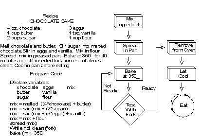

% A Crash Course in Programming
% R Bootcamp HTML Slides
% Jared Knowles and Nathan Calverley

```{r loading, include=FALSE}
library(ggplot2)
library(eeptools)
opts_knit$get(animation.fun = hook_scianimator)
opts_chunk$set(fig.path='figure/slidesXX-', cache.path='cache/slidesXX-',fig.width=12,fig.height=9,message=FALSE,error=FALSE,warning=FALSE,echo=TRUE,size='tiny',dev='png',out.width='600px',out.height='350px')

## Prepare the mtcars data
for(i in 1:15)
{
  TEMP <- mtcars
  mtcars <- rbind(mtcars,TEMP)
}

```

# Introduction
In this session we will be learning a little about what computer programming is through the following topics:

- History
- Basic Principles
- Syntax
- Memory Management

# What is a programming language?
- "A language intended for use by a person to express a process by which a computer can solve a problem" ~ Hope and Jiping
- "A set of conventions for communicating an algorithm" ~ E. Horowitz
- "the art of programming is the art of organizing complexity" ~ Dijkstra 1972

# History (Ancient)
- 300 BC -- First algorithm developed by Euclid (greatest common divisor)
- 1820-1850 -- Charles Babbage invents mechanical computational devices
  * Difference Engine
  * Analytical Engine
  * Countess Ada Augusta of Lovelace, first computer programmer
  * Wrote the first algorithm to be processed by the Analytical Engine, to compute Bernoulli numbers
  * Only legitimate child of Lord Byron

# History (less ancient)
- 1940s -- ENIAC developed to calculate trajectories by US DOD
- 1950s -- First high level programming language invented
  * John Backus
  * Fortran (R is based on this)
  * For punch card machines, to compute on numerical data
- 1956-1962 -- John McCarthy deveops LISP
  * Developed for non-numerical computation
  * Has garbage collection for memory management
- 1974 -- C developed at Bell Labs
  * D. Ritchie
  * Still heavily used today (in R)
  
# History (recent)
- 1985 -- C++ developed at Bell Labs by Bjorne Stroustrup
  * type-safe object oriented language
  * compile-time type checking
- 1995 -- Java developed by J. Gosling at SUN
  * Widely used across the web today
  * Portability across platform through use of abstract machine that implements language 

# HistoRy
- R plays nicely with many of these languages including Python, C++, Java, and of course C and Fortran
- R also plays nice with new technologies like HTML5 and CSS
- There are possibilities that R will be connected to newer web technologies as well like Ruby, JavaScript (some of this exists), and Processing


# Basic Principles
- A computer program (or software) is: 
  * A set of instructions which a computer can interpret to solve problems, make calculations, perform tasks
- A programming language is: 
  * A formal "language" that humans use to write programs that computers can understand
- An algorithm is: 
  * A precise set of instructions for solving a particular type of problem
  * Classic example is "Peanut Butter and Jelly Sandwich (PBJS) Algorithm"
  
# Programs and Algorithms
  - A computer program is the specific set of instructions that tells the hardward how to complete a particular algorithm
  - Different instructions can use different methods (mathematically equivalent) to reach the same end
  - 2+2 = 4
  - 2/1 + 2/1 = 4/1
  
# Algorithms
  - Conceptual and can be written in *psuedo code* (if this, then this)
  - Or as flow charts

<p align="center"></p>

# Models
- A model is an abstract (usually simplified) representation of something
  * Formulas that model physical processes
  * A line representing a trend in a data
  * Musical notation as a model of a song
- Computer programs interact with models to test scientific theories, processes, events, finance, games, etc.

# Desired Features
- Readable
  * Comments
  * Names
  * Syntax
- Simple to learn
  * A small number of concepts combine regularly without exceptions
- Portable
  * Standard across architectures
- Abstraction
  * Control and data structures that hide detail
- Efficient

# Compilation vs. Interpretation
- Compiled languages are translated into machine executable language
- Interpreted languages have programs translated and executed one step at a time by a "virtual machine"
- Compiling may take time, but it is often a one time cost
- There are also "just in time" compilers, these compile the code before it is run and behave like an interpreted language, but operate much faster (a new language, Julia, is a good example)

# Syntax and Rules
- We need to ensure that the instructions we give the computer are never ambiguous, and to ensure this there is a formalized structure we employ
- This is not unlike language we use in speech or writing
- The problem is that the computer in many cases cannot interpret our mistakes for us and only responds to commands that it expects

# Formalization
- Syntax and grammar of computer program languages force us to specify what we want the computer to do very carefully
- Example: Calculate the mean reading score for a school
- Use words to explain how the computer should do this
- The code might look something like `mean(readingscore[school=x])`

# Readability
- Believe it or not, when you are writing computer code, you are writing a document
- R script files or any source code should be **readable** and understandable with little context
- This means we need to employ a style guide (and like English, we have multiple choices)
- We need to employ some conventions in things like wrapping text in our source file
- Most importantly we need to give meaning to our code using comments

# Readability Example
- Consider this block of code:

```{r eval=FALSE,echo=TRUE}
df$a4<-df$a1 + df$a2 
df$a5<-df$a1/df$a4
df$a6<-df$a5*100
```

- There is no way to read or understand this without context

# Example 2
- Consider:
```{r eval=FALSE,echo=TRUE}
# Sum counts of male and female to get total
df$total<-df$male+df$female
# Get proporion
df$prop_male<-df$male/df$total
# Scale to percentages
df$percent_male<-df$prop_male * 100
```

# Tradeoffs
- Readable code takes longer to write
- It requires some judgment about how often you will use the code how much commenting and naming you need to do
- Sometimes, as you work, this will change! It is important for work that will be shared or used by others to make the code reusable and clean
- Working with others and sharing code actively is a great way to encourage this practice

# Other things you need
- Your script should have an author and a title wrapped in comments
- A date is good to include as well if the script is finished up
- References to outside resources are useful to include as well
- Formatting this so it sticks out is good
- Let's see:

# Example
```{r eval=FALSE,echo=TRUE}
######################################
# Title: My Super Script
# Author: Super Mario
# Date: 1980
# Subject: A script to master finding and raiding
#         castles
###################################

# Read data:
load("data/mydat.rda")

# Clean data...
```

# Coding and Recipes
- The difference with code and writing a text document is that the code is recipe to make something
- Recipes imply order - we cannot unscramble eggs once we break the yokes
- Code also implies order - we need to do things in a prespecified sequence to arrive at the result we desire
- Our code may need additional documentation to allow others to recreate this order
- The way we write it for ourselves, may not be sufficient for others
- "Two big spoons of sugar" does not have the same meaning in different contexts
- "150 grams of sugar" does

# Writing Code Is Writing
- It is technical and requires a focus on details
- Considering your audience is very important
- Considering the scope of your project is important too

# Sound Computing Tactics, Lesson 1: Elegance and Efficiency
- For any given coding task, there will always be many solutions.
- Some solutions are more elegant than others.
- Some solutions are more efficient than other.
- Some solutions are both; these are the best solutions.

# What is computational elegance?
- The term "elegance" refers to the simplicity and clarity of a piece of code.
- Generally speaking, simpler chunks of code are preferable to more complex ones.
- However, simple code is not always the most efficient.
- But for now, let's focus on elegance.

# Example 1 - Elegance in Repeated Tasks
- Scenario: You are given a set of data that contains information about different cars.
- You want to look at the average miles-per-gallon of the cars by number of cylinders.
- We also want to do this by the transmission of the car (manual vs. auto)
- How should we tackle this task?

# Solution 1: The "Brute Force" method
- The "Brute Force" method of programming is one in which the programmer relies on the 
computer's processing power, rather than first simplifying the problem before solving it.
- Example:

```{r}
mean(mtcars$mpg[mtcars$cyl==4 & mtcars$am==0])
mean(mtcars$mpg[mtcars$cyl==4 & mtcars$am==1])
mean(mtcars$mpg[mtcars$cyl==6 & mtcars$am==0])
mean(mtcars$mpg[mtcars$cyl==6 & mtcars$am==1])
mean(mtcars$mpg[mtcars$cyl==8 & mtcars$am==0])
mean(mtcars$mpg[mtcars$cyl==8 & mtcars$am==1])

median(mtcars$mpg[mtcars$cyl==4 & mtcars$am==0])
median(mtcars$mpg[mtcars$cyl==4 & mtcars$am==1])
median(mtcars$mpg[mtcars$cyl==6 & mtcars$am==0])
median(mtcars$mpg[mtcars$cyl==6 & mtcars$am==1])
median(mtcars$mpg[mtcars$cyl==8 & mtcars$am==0])
median(mtcars$mpg[mtcars$cyl==8 & mtcars$am==1])

min(mtcars$mpg[mtcars$cyl==4 & mtcars$am==0])
min(mtcars$mpg[mtcars$cyl==4 & mtcars$am==1])
min(mtcars$mpg[mtcars$cyl==6 & mtcars$am==0])
min(mtcars$mpg[mtcars$cyl==6 & mtcars$am==1])
min(mtcars$mpg[mtcars$cyl==8 & mtcars$am==0])
min(mtcars$mpg[mtcars$cyl==8 & mtcars$am==1])

max(mtcars$mpg[mtcars$cyl==4 & mtcars$am==0])
max(mtcars$mpg[mtcars$cyl==4 & mtcars$am==1])
max(mtcars$mpg[mtcars$cyl==6 & mtcars$am==0])
max(mtcars$mpg[mtcars$cyl==6 & mtcars$am==1])
max(mtcars$mpg[mtcars$cyl==8 & mtcars$am==0])
max(mtcars$mpg[mtcars$cyl==8 & mtcars$am==1])

```

# What are the problems with this method?
- It's clunky.
- It was probably written using some copy-paste action. In programming, copy-pasting can be
very dangerous.
- It's difficult to read from a programming perspective.

# Solution 2: Create a function
- Whenever you are performing a repeated task many times over, functions can help to
simplify your code, and to reduce the possibility of error from copy-pasting.

```{r}
## Here we define our function.
summarize_mtcars <- function(data,cyl){
    print(mean(data$mpg[data$cyl==cyl]))
    print(median(data$mpg[data$cyl==cyl]))
    print(min(data$mpg[data$cyl==cyl]))
    print(max(data$mpg[data$cyl==cyl]))}

## Now let's write a loop that calls the function
for(i in 1:length(unique(mtcars$cyl)))
{
  ## Isolate the manual transmission cars and auto transmission cars
  manual <- subset(mtcars,am==1)
  auto <- subset(mtcars,am==0)
    ## Send the data through the function
    summarize_mtcars(manual,i)
    summarize_mtcars(auto,i)
}

```

# How has the code been improved?
- Less code: The new code is 12 lines versus 24 lines in the original code.
- Less prone to error: Less code and less copy-pasting will translate to a smaller probability of error.
- More consistency: The use of a function means the repeated task will always be completed in exactly the same manner.
- This solution is much more elegant than the brute force method.

# Example 1 - Efficiency: mtcars
- Scenario: You are given a set of data that contains information about different cars.
- We want to look at the average miles-per-gallon of the cars by number of cylinders.
- We want to do this **for manual transmission cars only**
- How should we tackle this task?

# Solution 1: Write a ddply statement
- This will give us the desired result in just one line of code.

```{r,eval=TRUE}

ptime <- proc.time()[[3]]

average_scores <- ddply(mtcars, .(cyl),summarise,average_mpg=mean(mpg[am==1],na.rm=TRUE))

print(paste("Runtime: ",round(proc.time()[[3]]-ptime,digits=2)," seconds.",sep=""))

```

# ~2.4 seconds is a pretty short run-time considering the data set has over a million records. But how can we improve this?

# Solution 2: Subset the data, and then run the ddply.

```{r,eval=TRUE}

ptime <- proc.time()[[3]]

## Isolate the manual transmission cars in a temporary data frame
mtcars_temp <- subset(mtcars,am==1)

## Number of Records in original data: 1,048,576
## Number of Records in temporary data: 425,984

## Run the ddply on the temporary data frame
average_scores <- ddply(mtcars_temp, .(cyl),summarise,average_mpg=mean(mpg,na.rm=TRUE))

## Don't forget to remove the temporary data frame when we are done with it.
rm(mtcars_temp)

print(paste("Runtime: ",round(proc.time()[[3]]-ptime,digits=2)," seconds.",sep=""))

```

- By strategically managing our data set, we have cut the computational time nearly in half.

# Balancing Efficiency and Elegance
- In the previous example, we made computational time more efficient by making the code a little less elegant. 
- When dealing with large data sets, efficiency will sometimes be more important than elegance.
- Finding the right balance is key to writing good code.

# Sound Computing Tactics, Lesson 2: Global Variables
- A global variable is a data object whose value remains constant throughout the program.
- Global variables are a great way to centralize control of data

# Example 1 - Global Variables: mtcars
- Scenario: You are given a set of data that contains information about different cars.
- We want to look at various summary stats the cars by number of cylinders.
- We want to do this separately for cars with 4, 6, and 8 cylinders.
- How would this work WITHOUT global variables?

```{r,eval=TRUE}

mean(mtcars$mpg[mtcars$cyl==4])
mean(mtcars$mpg[mtcars$cyl==6])
mean(mtcars$mpg[mtcars$cyl==8])

median(mtcars$mpg[mtcars$cyl==4])
median(mtcars$mpg[mtcars$cyl==6])
median(mtcars$mpg[mtcars$cyl==8])

min(mtcars$mpg[mtcars$cyl==4])
min(mtcars$mpg[mtcars$cyl==6])
min(mtcars$mpg[mtcars$cyl==8])

max(mtcars$mpg[mtcars$cyl==4])
max(mtcars$mpg[mtcars$cyl==6])
max(mtcars$mpg[mtcars$cyl==8])

```

# What's wrong with this approach?
- It's clunky (brute force method.)
- Reading the output is difficult (which line is which??)
- Let's try using a global variable

```{r,eval=TRUE}
## Step 1: Create the global variable
cyl <- 4

## Step 2: Propogate the global variable throughout the conditional statements
mean(mtcars$mpg[mtcars$cyl==cyl])
median(mtcars$mpg[mtcars$cyl==cyl])
min(mtcars$mpg[mtcars$cyl==cyl])
max(mtcars$mpg[mtcars$cyl==cyl])

```

# How has this made our code better?
- The number of cylinders now only has to be specified in one place. Changes propogate automatically (centralized control.)
- Output is very easy to read.
- Significantly more elegant.

# Session Info

It is good to include the session info, e.g. this document is produced with **knitr** version `r packageVersion('knitr')`. Here is my session info:

```{r session-info}
print(sessionInfo(), locale=FALSE)
```

# References
- http://nlp.cs.nyu.edu/meyers/V22.0002/class%20slide%20pdfs/Intro-talk.pdf
- http://www.cs.rutgers.edu/~lou/314-f04-slides/topic01_intro.post.pdf
- http://www.python.org/doc/essays/cp4e.html


# Attribution and License
<p xmlns:dct="http://purl.org/dc/terms/">
<a rel="license" href="http://creativecommons.org/publicdomain/mark/1.0/">

</a>
<br />
This work (<span property="dct:title">R Tutorial for Education</span>, by <a href="www.jaredknowles.com" rel="dct:creator"><span property="dct:title">Jared E. Knowles</span></a>), in service of the <a href="http://www.dpi.wi.gov" rel="dct:publisher"><span property="dct:title">Wisconsin Department of Public Instruction</span></a>, is free of known copyright restrictions.
</p>
