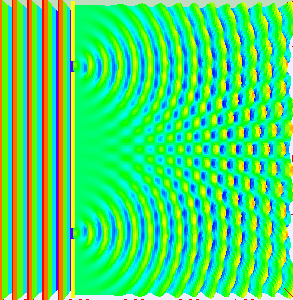
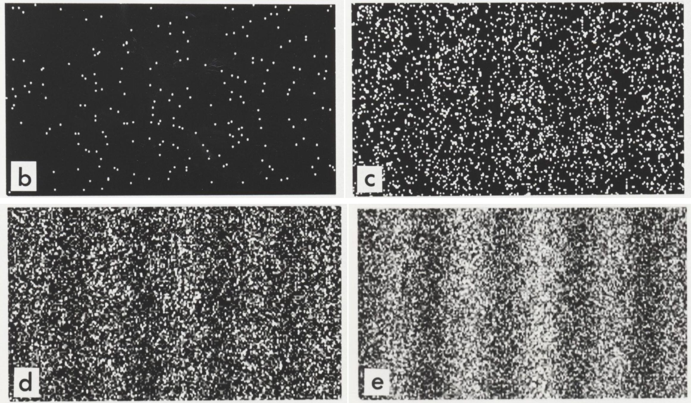

## But what does probability mean?

- A probability is quantified statement about how likely something will happen, ranging between 0 (absolutely certain not to happen), and 1 (absolutely certain to happen)
- In practicality, proving a probability of 0 or 1 is quite difficult, except the probability you will enjoy this session!
- Probabilities are inherently tied to the concept of repeatability, a probability represents the proportion of times we expect something to be successful over a reasonable number of trials

---

## The OP - Double Slit Electron Experiments

--- .quote

The laws of probability, so true in general, so fallacious in particular. Edward Gibbon

--- .quote .dark

The 50-50-90 rule: Anytime you have a 50-50 chance of getting something right, there's a 90% probability you'll get it wrong. Andy Rooney

---

## Probability
Three simple formulas

- $P(A \cap B) = P(A)P(B)$
- $P(A \cup B) = P(A) + P(B)$ - mutually exclusive A and B
- $P(A \cup B) = P(A) + P(B) - P(A and B)$ - not mutually exclusive
- They make sense and we use them everday.
- The first describes independent events -- like the chance two cards drawn from separate decks are the same suit. 
- The second describes mutually exclusive events, such as the chance of drawing **either** a single heart or a spade card from a single deck of cards. 
- The third describes events that are not mutually exlusive. The probability of drawing one card from a deck that is either a heart or a face card or both. 

---

## Meanwhile, in the real world

- We are familiar with these examples from school, but how about the real world?
- Events are not sequenced in the real world, we often have multiple conditions beyond A and B, and we often have different probabilities for different events. We may want to know the probability of event A, given a fixed outcome of probability B.
- We need conditional probability formulas:
- $P(A | B) = \frac{P(A \cap B)}{P(B)}$
- When drawing two aces from the same deck, the probability of drawing an ace on the first draw is $\frac{4}{52}$, but the probability of drawing a second ace conditional on already drawing an ace is $\frac{\frac{4}{52} \times  \frac{3}{51}}{\frac{4}{52}}$. Why?

---

## Real world

- Conditional probabilities are all around us, and are the most interesting to us
- What is the chance a student graduates high school, conditional on having a test score of X?
- What is the chance a student develops an alcohol problem, conditional on having Z type of friends?
- What is the chance a school meets AYP, conditional on receiving additional state and federal aid to improve instruction?
- Probability is often framed alternatively in terms of risk or odds

---

## Lotteries

- The lottery is one of the most classic cases of a conditional probability
- Let's run our own lottery
- Everyone pick 3 numbers from 1 to 6; and 1 powerball from 1 to 4
- Order does not matter except for the powerball
- Write them down on a piece of paper with your name and hand them in

---

## Exercise

- While I input your picks, think about what your odds of winning are
- Remember, after a number is drawn, it is not replaced so there is a $\frac{1}{6}$ then $\frac{1}{5}$, then $\frac{1}{4}$ choice set for three balls, plus the $\frac{1}{4}$ for the powerball.
- Why or why not might your answer be correct?

---

## Answers

> - Chaining together multiple probabilities really complicates things!
> - If we had to get the balls correctly in order, then the probability would be 
very straightforward: $\frac{1}{6} \times  \frac{1}{5} \times  \frac{1}{4} \times  \frac{1}{4}$
> - This is $\frac{1}{480}$, is that too low or too high?
> - But we can get them right in any order -- why does this matter?
> - How many unique combinations of your three numbers are there? 
> - 6
> - So out of 120 possibilities for those three numbers, you have a chance at 6, and out of the powerball you have the same chance, 1 in 4
> - What's the new probability?
> - $\frac{6}{120} \times  \frac{1}{4}$ or 0.0125 or $\frac{1}{80}$

---

## Let's see how much you won!

- For each of you, we'll assume you picked the same numbers each time for 1,000 separate lottery drawings
- We'll see how long it took you to win your first lottery, how many times you won, and how many times you would have won without the powerball being included
- Demo

---

## How do we apply this to our work?

> - What is the probability a student in Wisconsin will graduate from high school?
> - Is this a useful question? 
> - What additional information would help answer the question better? 
> - The list of conditional probabilities is quite large!
> - This is the basis for statistical modeling and statistical analysis

--- &quote

Probabilistic events generate data in particular patterns, these are called distributions

---

## Exploring Distributions

- Write down your estimate of the following three things on a piece of paper and hand them in, make a copy for yourself, keep your estimate to yourself for now:
 * How tall in inches (to the nearest quarter inch) is Jared?
 * What is the US Census estimate of the median household income in Illinois from 2007-2011, in dollars?
 * What is the current world record time in the women's marathon, in minutes?

--- 

## Graphing your Answers

- While we input your answers, talk with your neighbor about your estimates. Was your neighbor higher or lower than you? Would you change your estimate based on sharing information with your neighbor?
- Talk to another neighbor, would you change your estimate further? 
- Let's look at the responses from the group!

---

## Look at the answers

- Jared is 68.25 inches tall
- Illinois household income is $56,576 (http://quickfacts.census.gov/qfd/states/17000.html)
- Marathon time is 2:15:25, or 135.42 minutes (`http://en.wikipedia.org/wiki/Marathon_world_record_progression`)

---

## Here is something interesting

### My name 

--- &twocol w1:50% w2:50%

## Why?

***left
### Very interesting
> - Points to make
> - That you will like

***right
### Pay attention
> - To this
> - and this

---

